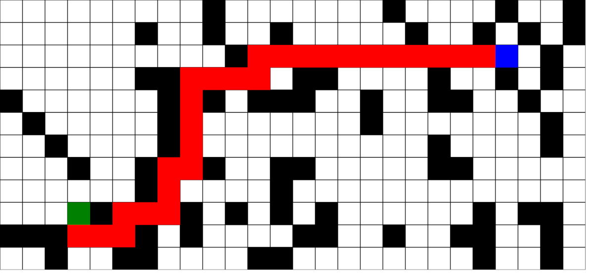

# Pathfind

[Live version](https://victorribeiro.com/pathfind)

## About

Using Breadth-First Search as pathfinder, visualizing the final path.

Click two points on the map and a path will be drawn, if there's one.
